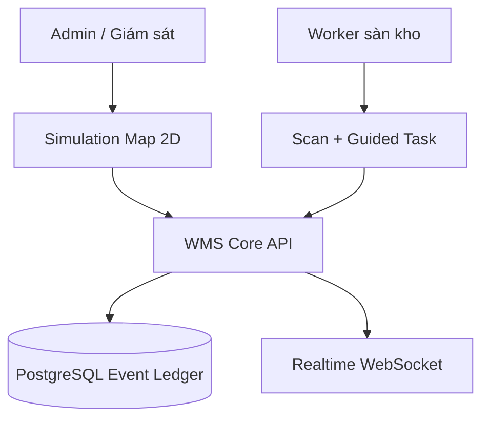
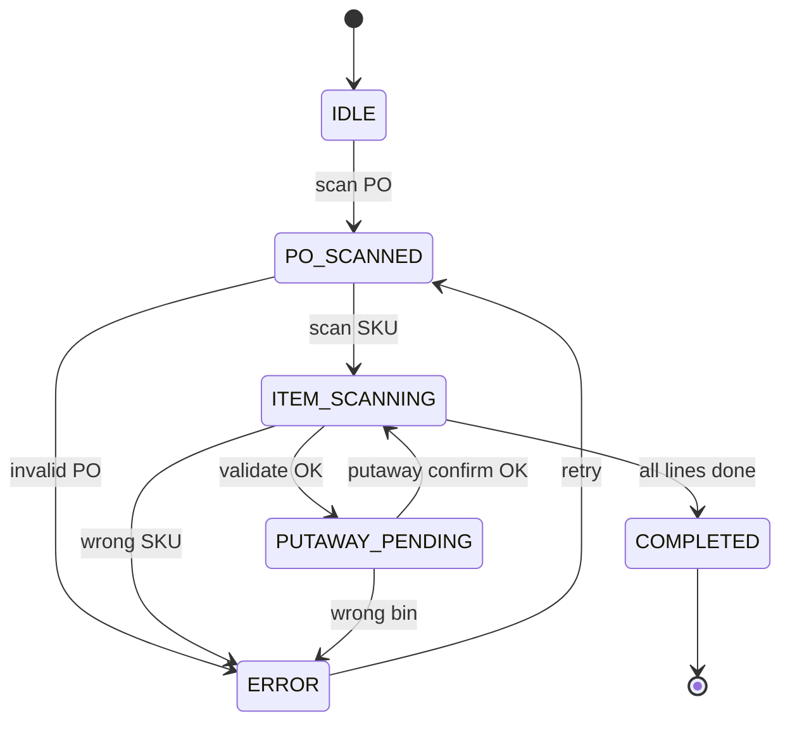
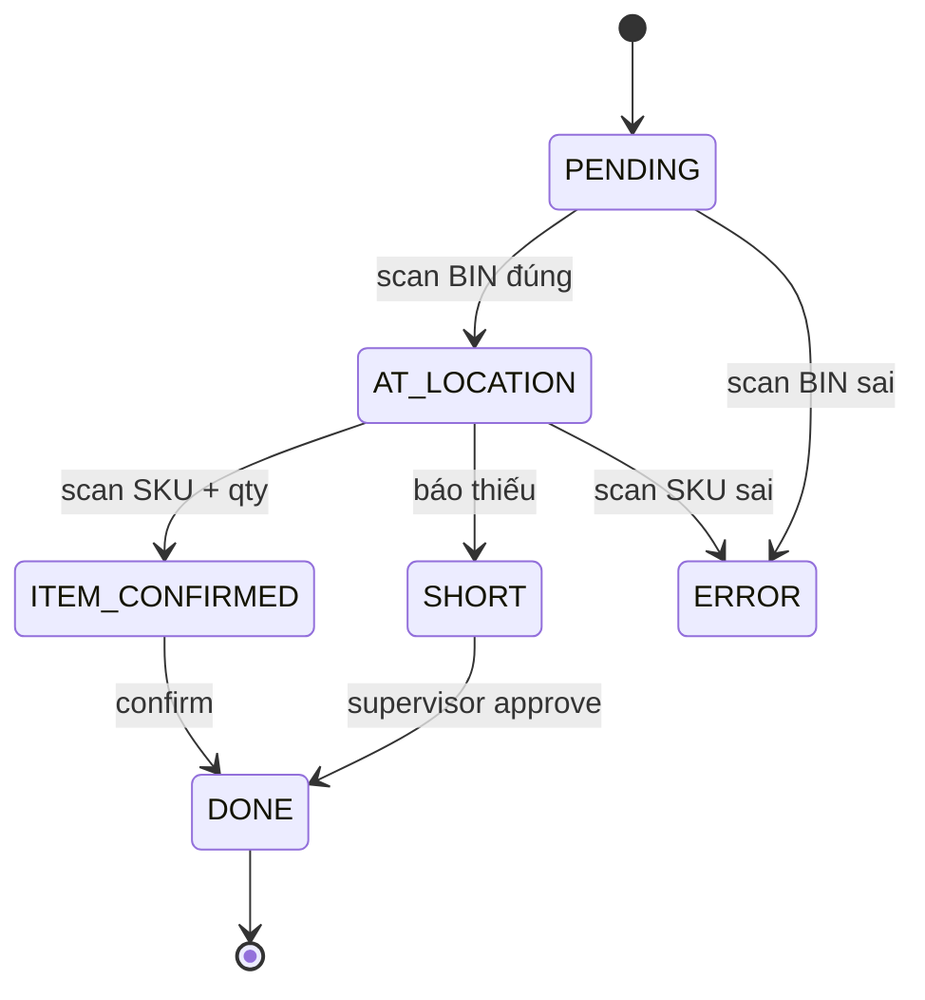
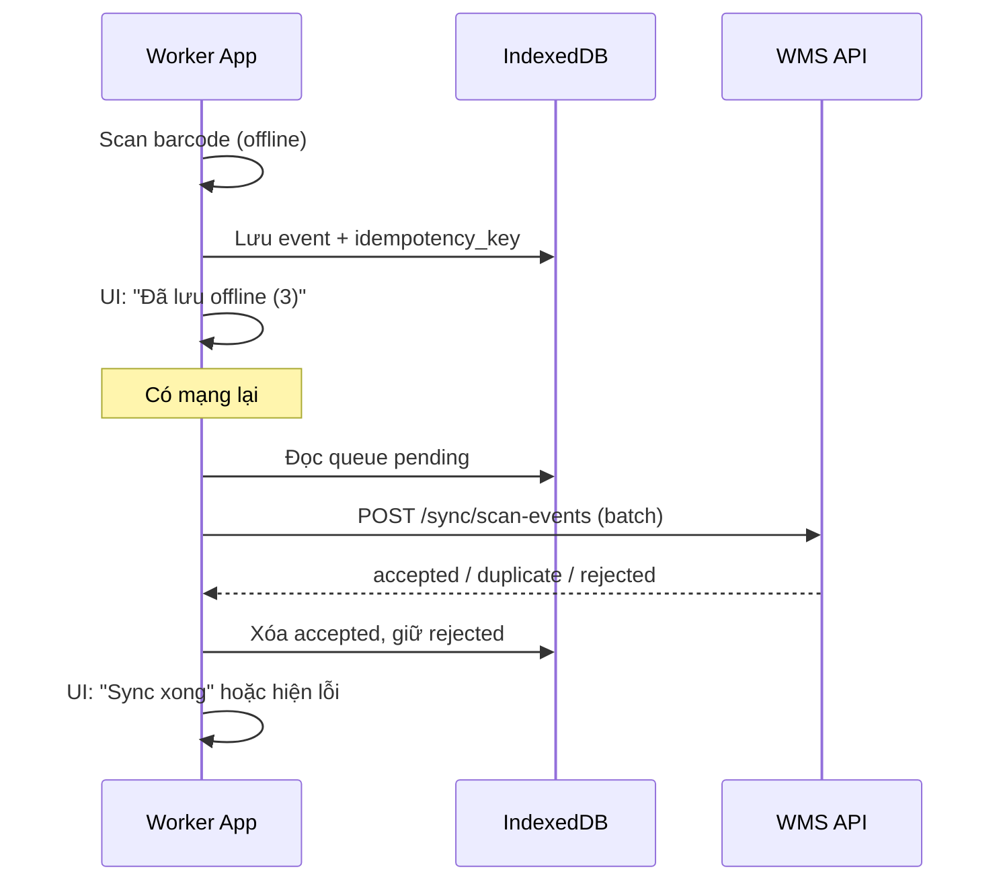

# Warehouse simulation app
_Exported on 7/9/2026 at 11:23:10 GMT+7 from Cursor (3.7.42)_

---

**User**

/last30days tôi muốn xây dựng một app web mô phỏng lại kho, khi xuất nhập kho thì hiển thị màn hình mô phỏng chọn khu, quét mã tự động lên hệ thống và công nhân chỉ việc đưa đến vị trí chỉ định

---

**Cursor**

Đang chạy `/last30days` cho ý tưởng app mô phỏng kho — kiểm tra cấu hình, tải WebSearch và thu thập cộng đồng liên quan.


Đang chạy engine với kế hoạch truy vấn và các cộng đồng đã xác định.


Engine trả về ít dữ liệu; đang bổ sung WebSearch và ghi vào file raw.


/last30days - đang tìm trên Reddit, Hacker News và Polymarket về app web mô phỏng kho với quét mã, chọn khu và chỉ đường cho công nhân.

**Pre-Flight:** chủ đề là concept/product build - không phải keyword trap, tiếp tục nghiên cứu.

**Resolved:**
- Reddit: r/logistics, r/warehousing, r/InventoryManagement, r/supplychain, r/webdev, r/SaaS, r/Entrepreneurs
- GitHub: [hightower-systems/sentry-wms](https://github.com/hightower-systems/sentry-wms), [infiniteoo/wms](https://github.com/infiniteoo/wms), [fjykTec/ModernWMS](https://github.com/fjykTec/ModernWMS), [h-builds/nexus-wms](https://github.com/h-builds/nexus-wms)
- TikTok: #warehousemanagement, #wms, #logistics, #barcodescanner

*Lưu ý: engine chỉ thu được 2 thread Reddit (tín hiệu mỏng). Phần dưới kết hợp engine + WebSearch supplements.*

🌐 last30days v? · synced 2026-07-08

What I learned:

**Ý tưởng của bạn khớp đúng workflow WMS chuẩn, không phải "game kho" riêng lẻ.** Luồng mà cộng đồng và các dự án open-source đang ship là: nhận hàng (receiving) → cất vào vị trí (put-away) → lấy hàng theo đơn (pick walk) → đóng gói → xuất. Mỗi bước đều scan-driven: quét PO, quét item, quét bin đích, hệ thống tự ghi nhận - công nhân chỉ cần đi đến vị trí hệ thống chỉ định. [Sentry WMS](https://github.com/hightower-systems/sentry-wms) mô tả rõ pattern này: put-away gợi ý bin rồi scan-to-confirm; picking trả về task tiếp theo theo thứ tự walk-path kèm zone/aisle.

**Màn hình "mô phỏng chọn khu" nên là digital twin 2D/2.5D gắn với location graph, không chỉ UI đẹp.** [Nexus WMS](https://github.com/h-builds/nexus-wms) (portfolio 2026) có module Orchestrator Twin Lite: layout kho 2.5D, heatmap occupancy theo zone, map zones → aisles → racks → bins lên backend graph. [Certexi WHMS](https://docs.certexi.com/docs/showcase/warehouse-3d) đi xa hơn: WebGL 3D + floor plan 2D, mọi thay đổi vị trí là event bất biến - state luôn derive từ ledger scan. [Warehouse Optimizer](https://warehouse-optimizer-pied.vercel.app) là demo web nhẹ hơn: mô phỏng multi-zone (R→A/B/C→P→S), so sánh route trước khi triển khai thật trên sàn.

**Quét mã "tự động lên hệ thống" - quyết định kiến trúc quan trọng nhất là loại scanner.** Bài [Medium tháng 6/2026](https://medium.com/@alaxhenry0121/i-built-a-production-wms-app-with-flutter-heres-what-the-warehouse-taught-me-about-code-91142f812858) từ dev ship WMS production: scanner công nghiệp (Zebra, Honeywell) không dùng camera - chúng bắn ký tự như bàn phím (~5ms/ký tự). Cần một ô input luôn focus, phân biệt scan vs gõ tay bằng timing, và `keyboardType` không autocorrect. [Sentry WMS](https://dev.to/mhightower932/i-built-an-open-source-wms-because-every-warehouse-management-system-costs-2000month-5nc) dùng broadcast intent trên Chainway C6000 - không phải camera web. Nếu bạn build **web app** cho điện thoại/tablet: PWA + camera (`html5-qrcode` / BarcodeDetector API) phù hợp demo và kho nhỏ; production nên hỗ trợ cả keyboard-wedge mode cho gun scanner.

**Offline-first là bắt buộc, không phải nice-to-have.** Kho có dead zone Wi-Fi. [Saigon Technology WMS guide](https://saigontechnology.com/blog/warehouse-management-system-development/) và bài Medium trên đều nhấn mạnh: queue scan local khi mất mạng, sync sau với idempotency key để không double-count. Inventory nên là ledger giao dịch bất biến (mỗi movement = một event), không mutate trực tiếp số tồn - pattern này xuất hiện ở cả [Certexi](https://docs.certexi.com/docs/showcase/warehouse-3d) lẫn các WMS portfolio khác.

**Tối ưu đường đi cho công nhân = graph + thuật toán pick-path.** Thư viện [pyWarehouse-routing](https://pypi.org/project/pyWarehouse-routing/) cho thấy cách model kho thành graph (nodes = giao lộ/vị trí pick, edges = lối đi), rồi chạy heuristic S-shape, Return, Midpoint hoặc TSP cho pick list. API kiểu `GET /picking/batch/{id}/next` của Sentry WMS trả task kế tiếp đã sort theo walk-path - đúng UX "chỉ việc đưa đến vị trí chỉ định".

Trên Reddit, [r/InventoryManagement](https://www.reddit.com/r/InventoryManagement/comments/1uhrlrd/how_can_i_strengthen_my_excel_invoicing_inventory/) (8 upvotes) nhắc kho lớn không dùng spreadsheet mà dùng WMS chuyên dụng; comment gợi ý tài liệu [ShipHero](https://www.shiphero.com/) để học quy trình kho thực tế.

KEY PATTERNS from the research:

1. **3 lớp tách biệt** - (a) simulation UI: map zone 2D/2.5D + heatmap; (b) task engine: put-away suggest + pick-path next; (c) scan capture: keyboard-wedge hoặc broadcast intent, offline queue.

2. **Data model** - hierarchy `Warehouse → Zone → Aisle → Rack → Bin`; mọi xuất/nhập = event scan (item, from_location, to_location, user, timestamp).

3. **Open-source tham khảo** - [Sentry WMS](https://github.com/hightower-systems/sentry-wms) (workflow đầy đủ + API pick/putaway), [ModernWMS](https://github.com/fjykTec/ModernWMS) (WMS đơn giản cho SME), [Nexus WMS](https://github.com/h-builds/nexus-wms) (twin + mobile), [JackPflaum/barcode-scanner](https://github.com/JackPflaum/barcode-scanner) (PWA workflow picking/count/move bằng prefix barcode).

4. **Stack gợi ý cho web app của bạn** - Frontend: Vue/React + canvas/WebGL cho simulation map; Backend: PostgreSQL + location graph; Realtime: WebSocket push task mới khi scan; Mobile floor: PWA hoặc React Native nếu cần gun scanner native.

5. **Pilot theo zone** - triển khai 1 zone trước (receiving + put-away), mở rộng pick walk sau - đúng lộ trình phased rollout mà các guide WMS khuyên dùng.

---
✅ All agents reported back!
├─ 🟠 Reddit: 2 threads │ 387 upvotes │ 159 comments
├─ 🗣️ Top voices: r/SaaS, r/InventoryManagement
└─ 📎 Raw results saved to ~/Documents/Last30Days/warehouse-simulation-web-app-barcode-scanning-wms-pick-zone-put-away-raw-v3.md
---

Tôi đã nắm được bức tranh: app mô phỏng kho + scan-driven workflow + guided picking là hướng đi đúng và có nhiều reference open-source. Bạn muốn tôi phác thảo kiến trúc chi tiết (DB schema, API endpoints, màn hình simulation) cho stack cụ thể (React, Vue, Laravel...) không?

---

**User**

 list ra check list để làm được mô hình này

---

**Cursor**

Dưới đây là checklist thực tế để xây app web mô phỏng kho theo mô hình bạn mô tả: **chọn khu → quét mã tự động → hệ thống chỉ vị trí → công nhân chỉ việc đi đến**.

---

## Phase 0 - Làm rõ phạm vi (1-2 ngày)

- [ ] Xác định loại kho: nhập / xuất / cả hai
- [ ] Xác định quy mô pilot: 1 kho, 1 zone, bao nhiêu bin/rack
- [ ] Xác định thiết bị quét: camera điện thoại (PWA) hay gun scanner (Zebra/Honeywell)
- [ ] Xác định người dùng: admin, supervisor, picker/put-away worker
- [ ] Vẽ sơ đồ luồng nghiệp vụ trên giấy:
  - Nhập: `PO → scan item → chọn khu → gợi ý bin → scan bin → hoàn tất`
  - Xuất: `SO → tạo pick list → chọn khu → next location → scan item → hoàn tất`
- [ ] Chọn stack (ví dụ: React/Vue + Node/Laravel + PostgreSQL + WebSocket)

---

## Phase 1 - Data model (nền tảng)

### 1.1 Cấu trúc vị trí kho
- [ ] `warehouses`
- [ ] `zones` (khu A/B/C, receiving, storage, packing, shipping)
- [ ] `aisles` (lối đi)
- [ ] `racks` (kệ)
- [ ] `bins` (ô chứa - đơn vị pick/put-away nhỏ nhất)
- [ ] Mỗi bin có: `code`, `barcode`, `zone_id`, tọa độ map (`x`, `y`, `z`), trạng thái (`empty/partial/full/blocked`)

### 1.2 Hàng hóa & tồn kho
- [ ] `items` / `skus` (mã, tên, barcode)
- [ ] `inventory_ledger` (event-based, không sửa trực tiếp số tồn)
  - Mỗi event: `item_id`, `from_bin`, `to_bin`, `qty`, `type`, `user_id`, `timestamp`, `scan_id`
- [ ] `inventory_balance` (view/tổng hợp từ ledger)

### 1.3 Đơn nghiệp vụ
- [ ] `purchase_orders` + `po_lines` (nhập)
- [ ] `sales_orders` + `so_lines` (xuất)
- [ ] `putaway_tasks` (cất hàng)
- [ ] `pick_tasks` / `pick_batches` (lấy hàng)
- [ ] Trạng thái task: `pending → in_progress → done / short / cancelled`

### 1.4 Scan & audit
- [ ] `scan_events` (raw log mọi lần quét)
- [ ] `idempotency_key` cho mỗi scan (tránh ghi trùng khi offline sync)
- [ ] `audit_log` (ai làm gì, lúc nào, ở bin nào)

---

## Phase 2 - Backend API (core logic)

### 2.1 Master data
- [ ] CRUD kho, zone, bin
- [ ] Import layout kho (CSV/JSON)
- [ ] CRUD SKU + barcode mapping

### 2.2 Nhập kho (Receiving)
- [ ] `POST /receiving/start` - mở phiên nhập theo PO
- [ ] `POST /receiving/scan-item` - quét item, validate với PO
- [ ] `GET /putaway/suggest/{item_id}` - gợi ý bin phù hợp
- [ ] `POST /putaway/confirm` - quét bin đích, ghi ledger
- [ ] `POST /receiving/complete` - đóng phiên nhập

### 2.3 Xuất kho (Picking)
- [ ] `POST /picking/create-batch` - gom SO thành batch
- [ ] `GET /picking/batch/{id}/next` - trả task tiếp theo theo walk-path
- [ ] `POST /picking/confirm` - quét đúng item tại đúng bin
- [ ] `POST /picking/short` - báo thiếu hàng
- [ ] `POST /picking/complete-batch`

### 2.4 Simulation / routing
- [ ] Build location graph: node = bin/giao lộ, edge = lối đi
- [ ] Thuật toán sắp xếp pick path (bắt đầu đơn giản: zone → aisle → bin)
- [ ] API trả: `next_bin`, `distance`, `zone`, `aisle`, `instruction_text`
- [ ] (Tuỳ chọn) heatmap occupancy theo zone

### 2.5 Realtime
- [ ] WebSocket push khi:
  - task mới được assign
  - scan thành công
  - bin thay đổi trạng thái
  - worker hoàn thành 1 bước

---

## Phase 3 - Màn hình mô phỏng kho (web)

### 3.1 Map 2D / 2.5D
- [ ] Canvas/SVG/WebGL hiển thị layout kho
- [ ] Màu theo zone (receiving, storage, packing, shipping)
- [ ] Highlight bin đang active (xanh = đích, vàng = đang pick, đỏ = blocked)
- [ ] Click bin → xem SKU, qty, lịch sử scan gần nhất
- [ ] Heatmap mức độ đầy theo zone

### 3.2 Màn hình chọn khu
- [ ] Khi bắt đầu nhập/xuất: chọn zone làm việc
- [ ] Lọc task chỉ trong zone đó (zone picking)
- [ ] Hiển thị số task pending / in_progress / done

### 3.3 Màn guided worker
- [ ] Panel lớn: **"Đi đến: Zone B - Aisle 3 - Bin B3-12"**
- [ ] Map zoom tới vị trí đích + đường đi gợi ý
- [ ] Nút `Next task` sau khi scan thành công
- [ ] Progress: `3/15 items picked`

### 3.4 Dashboard supervisor
- [ ] Tổng đơn đang xử lý
- [ ] Worker đang ở zone nào
- [ ] Bin lỗi / short pick / scan fail
- [ ] Timeline hoạt động realtime

---

## Phase 4 - Quét mã (quan trọng)

### 4.1 Web/PWA mode (camera)
- [ ] PWA installable trên tablet/điện thoại
- [ ] Tích hợp `BarcodeDetector` hoặc `html5-qrcode`
- [ ] Ô scan luôn focus
- [ ] Validate barcode type theo bước workflow (PO / item / bin / SO)

### 4.2 Gun scanner mode (production)
- [ ] Hỗ trợ keyboard wedge: scanner bắn text + Enter
- [ ] Phân biệt scan vs gõ tay (khoảng cách giữa ký tự < 50ms)
- [ ] Tắt autocorrect trên input scan
- [ ] (Nếu native app) broadcast intent cho Zebra/Chainway/Honeywell

### 4.3 Quy tắc scan
- [ ] Scan sai loại mã → báo lỗi rõ ràng
- [ ] Scan đúng item sai bin → chặn
- [ ] Scan trùng → idempotency, không ghi 2 lần
- [ ] Mọi scan đều lưu raw event trước khi xử lý business logic

---

## Phase 5 - Offline-first (bắt buộc cho kho thật)

- [ ] Local queue scan khi mất mạng (IndexedDB / SQLite mobile)
- [ ] Sync khi có mạng lại
- [ ] Conflict rule: server wins hoặc last-write-with-audit
- [ ] UI badge `Offline mode` / `Syncing...`
- [ ] Test mất Wi-Fi giữa chừng khi đang pick

---

## Phase 6 - Business rules cần có sớm

- [ ] Put-away rule: ưu tiên bin cùng SKU, bin gần receiving, bin còn capacity
- [ ] Pick rule: FIFO / FEFO (nếu có hạn dùng)
- [ ] Zone rule: worker chỉ nhận task trong zone được assign
- [ ] Short pick rule: cho phép báo thiếu và chuyển task
- [ ] Không cho pick từ bin `blocked` / `quarantine`

---

## Phase 7 - Dữ liệu demo & test

- [ ] Seed 1 kho mẫu: 3-5 zones, 50-200 bins
- [ ] 20-50 SKU có barcode
- [ ] 5 PO nhập mẫu
- [ ] 5 SO xuất mẫu
- [ ] In/generate barcode test (item + bin)
- [ ] Kịch bản test:
  - [ ] Nhập đủ PO
  - [ ] Nhập thiếu PO
  - [ ] Put-away sai bin
  - [ ] Pick đúng thứ tự walk-path
  - [ ] Pick short
  - [ ] Offline 10 phét rồi sync lại

---

## Phase 8 - MVP release (nên làm theo thứ tự)

### Sprint 1 - Xương sống
- [ ] Location model + import layout
- [ ] Scan item + scan bin
- [ ] Ledger inventory
- [ ] 1 màn map 2D highlight bin

### Sprint 2 - Nhập kho
- [ ] PO receiving
- [ ] Put-away suggest + confirm
- [ ] Màn chọn zone khi nhập

### Sprint 3 - Xuất kho
- [ ] Tạo pick batch
- [ ] `next task` theo path
- [ ] Guided screen cho worker

### Sprint 4 - Vận hành
- [ ] Offline queue
- [ ] Dashboard supervisor
- [ ] Audit log + báo cáo

---

## Phase 9 - Tham khảo open-source (đỡ đi sai đường)

- [ ] Đọc workflow [Sentry WMS](https://github.com/hightower-systems/sentry-wms) - receiving/putaway/picking API
- [ ] Xem layout twin [Nexus WMS](https://github.com/h-builds/nexus-wms) - zone map + heatmap
- [ ] Tham khảo PWA scan workflows [barcode-scanner](https://github.com/JackPflaum/barcode-scanner)
- [ ] Nếu cần thuật toán đường đi: [pyWarehouse-routing](https://pypi.org/project/pyWarehouse-routing/)

---

## Phase 10 - Tiêu chí "đã làm được mô hình"

Coi là **đạt MVP** khi:

- [ ] Admin upload được layout kho có zone/bin
- [ ] Worker mở app, chọn zone, nhận task
- [ ] Quét mã item + bin, hệ thống tự ghi nhận không nhập tay
- [ ] Màn simulation highlight đúng vị trí cần đến
- [ ] Sau scan, app tự chuyển sang vị trí tiếp theo
- [ ] Supervisor nhìn dashboard thấy tiến độ realtime
- [ ] Mất mạng vẫn scan được, có mạng sync lại không mất dữ liệu

---

## Thứ tự ưu tiên nếu muốn làm nhanh

1. **Location graph + bin barcode**
2. **Scan engine + inventory ledger**
3. **Put-away suggest + confirm**
4. **Pick batch + next task**
5. **Map simulation highlight**
6. **Offline sync**
7. **Heatmap / 3D** (làm sau)

---

Nếu bạn muốn, tôi có thể viết tiếp **checklist kỹ thuật chi tiết hơn** theo 1 stack cụ thể (ví dụ React + Node + PostgreSQL) gồm DB schema, danh sách API, và wireframe từng màn hình.

---

**User**

tạo các promtp và mô phỏng lại quy trình cho tôi

---

**Cursor**

Dưới đây là **bộ prompt dùng lại được** và **mô phỏng quy trình end-to-end** cho mô hình kho của bạn.

---

# PHẦN 1 - PROMPT TEMPLATE (copy/paste)

## Prompt A - Thiết kế kiến trúc hệ thống

```text
Bạn là senior full-stack architect. Thiết kế hệ thống WMS web app mô phỏng kho với các yêu cầu:

Mục tiêu:
- Web app mô phỏng layout kho 2D theo zone/aisle/rack/bin
- Khi nhập/xuất: worker chọn khu → quét mã → hệ thống tự ghi nhận → chỉ vị trí tiếp theo
- Worker chỉ việc đi đến vị trí được chỉ định

Yêu cầu kỹ thuật:
- Stack: React + Node.js + PostgreSQL + WebSocket
- Inventory dùng event ledger (không mutate trực tiếp)
- Offline-first cho scan events
- Hỗ trợ camera PWA và gun scanner (keyboard wedge)

Output cần có:
1) Kiến trúc module (frontend/backend/realtime)
2) DB schema (bảng + quan hệ)
3) Danh sách API endpoint theo workflow
4) State machine cho receiving, put-away, picking
5) Rule put-away suggest và pick-path next
6) MVP theo 4 sprint

Viết ngắn gọn, có diagram ASCII và ví dụ JSON request/response.
```

---

## Prompt B - Thiết kế màn hình simulation

```text
Thiết kế UI/UX cho WMS simulation web app.

Các màn hình bắt buộc:
1) Dashboard supervisor
2) Warehouse map 2D (zone màu, bin highlight)
3) Chọn khu làm việc (zone picker)
4) Màn worker guided task ("Đi đến Zone B - Aisle 3 - Bin B3-12")
5) Màn scan (camera + input gun scanner)
6) Lịch sử scan/audit

Yêu cầu UX:
- Font lớn, thao tác 1 tay trên tablet
- Luôn hiển thị "task hiện tại" + "task kế tiếp"
- Màu trạng thái: pending (xám), active (xanh), done (xanh đậm), error (đỏ)
- Map tự zoom vào bin đích
- Không yêu cầu nhập tay sau khi scan

Output:
- Wireframe text từng màn
- Component tree React
- Danh sách props/state chính
- 5 trạng thái lỗi scan và message hiển thị
```

---

## Prompt C - Sinh API + business logic

```text
Implement backend WMS cho workflow scan-driven.

Workflow:
Receiving:
PO scan -> item scan -> put-away suggest bin -> bin scan confirm

Picking:
SO scan -> create pick batch -> next task by walk-path -> item scan confirm

Tạo:
- OpenAPI spec
- SQL migration PostgreSQL
- Pseudo-code service layer cho:
  - suggestPutawayBin(item_id, zone_id)
  - createPickBatch(so_ids, zone_id)
  - getNextPickTask(batch_id)
  - confirmScan(event)
- Idempotency cho scan event
- Validation rules (scan sai loại mã, scan sai bin, short pick)

Kèm test cases (happy path + 8 edge cases).
```

---

## Prompt D - Sinh dữ liệu demo kho

```text
Tạo dataset demo cho WMS simulation:

Kho: WH-HCM-01
Zones: RECEIVING, ZONE-A, ZONE-B, PACKING, SHIPPING
Bins: 120 bins, naming A1-01 ... C4-10
SKUs: 30 SKU có barcode
PO: 2 đơn nhập
SO: 3 đơn xuất

Output JSON gồm:
- warehouses, zones, aisles, racks, bins (có tọa độ x,y cho map 2D)
- items/skus
- purchase_orders + lines
- sales_orders + lines
- 10 scan_events mẫu
- 1 pick_batch mẫu với walk-path đã sort

Đảm bảo dữ liệu realistic cho demo nhập/xuất trong 1 ca làm việc.
```

---

## Prompt E - Prompt vận hành cho AI agent trong app (nếu có copilot)

```text
Bạn là trợ lý điều phối kho. Nhiệm vụ: hướng dẫn worker theo task hiện tại.

Input:
- worker_id
- current_task
- last_scan_event
- warehouse_map_context

Output JSON:
{
  "instruction_vi": "...",
  "next_action": "scan_item|scan_bin|move_to_location|report_short",
  "target": {"zone":"", "aisle":"", "bin":""},
  "warnings": [],
  "progress": {"done":0,"total":0}
}

Quy tắc:
- Không cho skip bước scan
- Nếu scan sai, nói rõ scan gì tiếp theo
- Câu ngắn, dễ đọc trên sàn kho
- Luôn ưu tiên an toàn và đúng bin
```

---

# PHẦN 2 - MÔ PHỎNG QUY TRÌNH (kịch bản thực tế)

## Bối cảnh demo

| Thực thể | Giá trị |
|---|---|
| Kho | `WH-HCM-01` |
| Worker | `Nguyen Van A` (zone B) |
| Supervisor | `Tran Thi B` |
| Thiết bị | Tablet + gun scanner |

**Zones:**
- `RECEIVING` - cửa nhận
- `ZONE-A` - hàng nhanh
- `ZONE-B` - hàng thường
- `PACKING` - đóng gói
- `SHIPPING` - xuất hàng

---

## FLOW 1 - NHẬP KHO (Receiving → Put-away)

### Bước 0 - Supervisor tạo PO

```json
PO-1001:
- SKU-MILK-1L x 50
- SKU-RICE-5KG x 20
```

---

### Bước 1 - Worker chọn khu

**Màn hình:** `Chọn khu làm việc`

```
[ RECEIVING ]  [ ZONE-A ]  [ ZONE-B ]
```

Worker chọn: `RECEIVING`

**Hệ thống hiển thị:**
> Bạn đang ở khu RECEIVING. Quét mã PO để bắt đầu nhập.

---

### Bước 2 - Scan PO

| Hành động | Giá trị |
|---|---|
| Scan | `PO-1001` |
| Hệ thống | Mở phiên nhập, load 2 dòng hàng |
| UI | `PO-1001 | 0/2 dòng hoàn tất` |

---

### Bước 3 - Scan item đầu tiên

| Hành động | Giá trị |
|---|---|
| Scan | `SKU-MILK-1L` |
| Validate | Khớp PO line |
| Gợi ý bin | `ZONE-A / Aisle 2 / Bin A2-08` (cùng SKU, gần receiving) |

**Màn simulation map:**
- Zoom `ZONE-A`
- Highlight bin `A2-08` màu xanh
- Đường đi: `RECEIVING → A2-08`

**Lệnh cho worker:**
> Mang SKU-MILK-1L đến Bin A2-08, sau đó quét mã bin để xác nhận.

---

### Bước 4 - Scan bin xác nhận put-away

| Hành động | Giá trị |
|---|---|
| Scan | `BIN-A2-08` |
| Kết quả | Ghi ledger `+50 MILK vào A2-08` |
| UI | `PO-1001: 1/2 dòng hoàn tất` |

---

### Bước 5 - Scan item thứ hai

| Hành động | Giá trị |
|---|---|
| Scan | `SKU-RICE-5KG` |
| Gợi ý bin | `ZONE-B / B3-12` |

Worker đi + scan bin `BIN-B3-12` → hoàn tất PO.

---

### Bước 6 - Đóng phiên nhập

```
PO-1001: COMPLETED
- MILK-1L: 50 -> A2-08
- RICE-5KG: 20 -> B3-12
Thời gian: 14 phút
```

---

## FLOW 2 - XUẤT KHO (Picking guided)

### Bối cảnh

```json
SO-2001:
- SKU-MILK-1L x 10 (lấy từ A2-08)
- SKU-RICE-5KG x 5 (lấy từ B3-12)
```

---

### Bước 1 - Worker chọn khu

Worker `Nguyen Van A` chọn `ZONE-A` (chỉ nhận task zone A trước).

---

### Bước 2 - Tạo pick batch

Supervisor/system tạo:

```
BATCH-9001 (SO-2001, zone filter: ALL)
Walk-path:
1) ZONE-A / A2-08 / MILK-1L x10
2) ZONE-B / B3-12 / RICE-5KG x5
```

---

### Bước 3 - Task 1 (guided)

**Màn worker:**

```
TASK 1/2
Đi đến: ZONE-A > Aisle 2 > Bin A2-08
Lấy: SKU-MILK-1L x 10
```

**Map simulation:**
- Highlight `A2-08`
- Worker icon di chuyển theo route

**Scan sequence:**
1. Scan `BIN-A2-08` (đúng vị trí)
2. Scan `SKU-MILK-1L` (đúng hàng)
3. Nhập/scan qty `10`
4. `Confirm` → task 1 done

---

### Bước 4 - Task 2 (guided)

```
TASK 2/2
Đi đến: ZONE-B > Aisle 3 > Bin B3-12
Lấy: SKU-RICE-5KG x 5
```

Worker scan bin + scan item + qty → batch complete.

---

### Bước 5 - Chuyển sang PACKING

```
BATCH-9001 COMPLETED
Chuyển hàng đến PACKING-01
Quét: TOTE-7788 để gắn đơn SO-2001
```

---

## FLOW 3 - XỬ LÝ LỖI (mô phỏng edge cases)

### Case 1 - Scan sai bin

| | |
|---|---|
| Task | Lấy tại `A2-08` |
| Worker scan | `A2-09` |
| Hệ thống | `SAI VỊ TRÍ. Bạn cần đến Bin A2-08` |
| Map | `A2-09` đỏ, `A2-08` nhấp nháy xanh |

### Case 2 - Thiếu hàng (short pick)

| | |
|---|---|
| Task | `MILK x10`, thực tế còn `7` |
| Worker | Bấm `Short pick`, nhập `7` |
| Hệ thống | Tạo exception, supervisor duyệt, SO chuyển `partial` |

### Case 3 - Mất mạng

| | |
|---|---|
| Worker scan | 3 lần khi offline |
| Local queue | Lưu 3 `scan_events` |
| Có mạng lại | Sync theo `idempotency_key`, không ghi trùng |

---

# PHẦN 3 - PROMPT MÔ PHỎNG THEO TỪNG CA (dùng với AI)

## Prompt F - Mô phỏng 1 ca nhập hàng

```text
Mô phỏng chi tiết 1 ca nhập hàng WMS trong 20 phút.

Input:
- PO-1001 gồm 3 SKU
- 1 worker, 1 supervisor
- Kho có 4 zones

Yêu cầu output:
1) Timeline từng phút (T+0 -> T+20)
2) Mỗi bước: hành động worker, mã quét, phản hồi hệ thống
3) Trạng thái map simulation sau mỗi bước
4) Event ledger được ghi như thế nào
5) 2 lỗi phát sinh và cách xử lý

Viết bằng tiếng Việt, format bảng + JSON event mẫu.
```

## Prompt G - Mô phỏng 1 ca xuất hàng

```text
Mô phỏng chi tiết 1 ca xuất hàng với zone picking.

Input:
- SO-2001 (4 dòng hàng, 2 zones)
- Batch picking + walk-path optimization đơn giản

Output:
1) Pick path trước/sau tối ưu
2) Task list theo thứ tự đi
3) Màn hình worker tại mỗi task
4) Scan validation rules
5) KPI: số bước đi, thời gian, accuracy

Kèm pseudo API calls cho từng bước.
```

## Prompt H - Sinh test script QA

```text
Tạo bộ test manual + automated cho WMS simulation app.

Bao gồm:
- 10 test case nhập kho
- 10 test case xuất kho
- 8 test case lỗi scan
- 5 test case offline sync

Mỗi case gồm:
- Preconditions
- Steps
- Expected UI
- Expected DB events
- Severity (P0/P1/P2)
```

---

# PHẦN 4 - SCRIPT DEMO 3 PHÚT (để bạn trình bày)

```text
PHÚT 1 - NHẬP
- Mở app -> chọn RECEIVING
- Scan PO-1001
- Scan SKU-MILK-1L
- Map chỉ A2-08
- Scan BIN-A2-08 -> +50

PHÚT 2 - XUẤT
- Chọn ZONE-A
- Mở BATCH-9001 cho SO-2001
- Task 1: đi A2-08, scan bin + item
- Task 2: đi B3-12, scan bin + item

PHÚT 3 - GIÁM SÁT
- Supervisor mở dashboard
- Xem heatmap zone occupancy
- Xem audit log scan
- Đóng SO-2001 -> chuyển PACKING
```

---

# PHẦN 5 - MẪU EVENT JSON (để dev implement ngay)

```json
{
  "event_id": "evt_00091",
  "type": "PUTAWAY_CONFIRM",
  "warehouse_id": "WH-HCM-01",
  "worker_id": "W-001",
  "po_id": "PO-1001",
  "item_barcode": "SKU-MILK-1L",
  "from_location": "RECEIVING-STAGING",
  "to_bin": "A2-08",
  "qty": 50,
  "scan_device": "gun_scanner",
  "idempotency_key": "PO-1001|MILK|A2-08|50",
  "timestamp": "2026-07-08T14:05:12+07:00"
}
```

```json
{
  "batch_id": "BATCH-9001",
  "next_task": {
    "seq": 1,
    "zone": "ZONE-A",
    "aisle": "A2",
    "bin": "A2-08",
    "item_barcode": "SKU-MILK-1L",
    "qty_required": 10,
    "instruction_vi": "Đi đến Bin A2-08 và quét mã bin trước"
  }
}
```

---

Nếu bạn muốn bước tiếp theo, tôi có thể tạo luôn **file `docs/warehouse-simulation-playbook.md`** trong project với:
1. toàn bộ prompt trên,
2. 2 kịch bản mô phỏng đầy đủ (nhập + xuất),
3. danh sách API + test case để team dev/code ngay.

---

**User**

https://github.com/hightower-systems/sentry-wms  repo này có thể lấy về và thực hiện được không

---

**Cursor**

Đang kiểm tra repo Sentry WMS và tài liệu bạn upload để đánh giá khả năng clone và triển khai.


**Có - clone và chạy được**, nhưng cần hiểu rõ Sentry WMS **là gì** và **không phải gì** so với ý tưởng mô phỏng kho 2D của bạn.

Tôi đã clone thử repo về máy bạn (`_tmp-sentry-wms`) - repo public, license **Apache 2.0** (dùng/sửa thương mại được).

---

## Kết luận nhanh

| Câu hỏi | Trả lời |
|---|---|
| Clone về được không? | **Có** |
| Chạy demo được không? | **Có**, nếu cài **Docker Desktop** |
| Dùng luôn cho ý tưởng của bạn? | **Một phần** - workflow scan có sẵn, **chưa có màn mô phỏng kho 2D** |
| Build app web mô phỏng trên nền này? | **Có** - fork Sentry, thêm layer visualization |

---

## Sentry WMS phù hợp phần nào với ý tưởng của bạn

**Đã có sẵn (khớp ~70% logic nghiệp vụ):**

- **Receiving** - quét PO, nhận hàng vào staging
- **Put-away** - gợi ý bin + scan xác nhận
- **Picking** - batch pick, walk-path tối ưu, `next task` theo zone/aisle
- **Zones / Bins / Items** - cấu hình kho trên admin
- **Barcode scan-driven** - mobile app React Native (Expo)
- **Admin panel** web - dashboard, audit log, import CSV/JSON

**Chưa có (phần bạn muốn thêm):**

- Màn **mô phỏng layout kho 2D/2.5D** (map, heatmap, highlight bin)
- Worker chạy **100% trên web/PWA** - Sentry dùng **app mobile riêng**, tối ưu cho gun scanner (Chainway C6000 broadcast intent), không phải camera browser
- Màn **"chọn khu" kiểu simulation** trực quan - admin chỉ có danh sách/bảng zone, không có floor plan

---

## Yêu cầu để chạy được trên máy bạn

Repo cần stack này:

| Thành phần | Ghi chú |
|---|---|
| **Docker Desktop** | Bắt buộc cho quick start - máy bạn **chưa có Docker** |
| PostgreSQL 16 | Chạy trong Docker |
| Redis + Celery | Background jobs |
| Python/Flask API | Port 5000 |
| Admin React | Port **8080** |
| Mobile Expo | Terminal riêng, cần Node.js |

`.env` bắt buộc generate 4 secret (app **không boot** nếu thiếu):

```powershell
# JWT_SECRET
python -c "import secrets; print(secrets.token_hex(32))"

# SENTRY_ENCRYPTION_KEY
python -c "from cryptography.fernet import Fernet; print(Fernet.generate_key().decode())"

# REDIS_PASSWORD + SENTRY_TOKEN_PEPPER + SENTRY_PUBSUB_HMAC_KEY
python -c "import secrets; print(secrets.token_hex(32))"
```

---

## Các bước chạy demo (sau khi cài Docker)

```powershell
git clone https://github.com/hightower-systems/sentry-wms.git
cd sentry-wms
copy .env.example .env
# Dán các secret vào .env

docker compose up -d
```

Sau khi lên:

- API: `http://localhost:5000/api/health`
- Admin: `http://localhost:8080` (login `admin` / `admin`, đổi mật khẩu lần đầu)
- Mobile (terminal khác):

```powershell
cd mobile
copy .env.example .env
# EXPO_PUBLIC_API_URL = IP máy bạn (không dùng localhost trên điện thoại)
npm install
npx expo start
```

Repo có **seed data demo** sẵn (`seed-apartment-lab.sql`) - không cần nhập tay từ đầu.

---

## Đánh giá thực tế cho case của bạn

### Nếu mục tiêu: "có hệ thống WMS scan-driven chạy được nhanh"
→ **Nên dùng Sentry làm nền.** Fork repo, customize zone/bin, chạy workflow nhập-xuất thật.

### Nếu mục tiêu: "app web mô phỏng kho, worker nhìn map và đi theo vị trí"
→ **Không đủ nguyên repo.** Cần **fork + build thêm**:

1. Giữ **API picking/putaway** của Sentry (đã có walk-path, suggest bin)
2. Thêm module **Warehouse Map** trong `admin/` hoặc app web mới:
   - Đọc zones/bins từ API có sẵn
   - Render canvas 2D theo tọa độ bin
   - Gọi `GET /api/picking/batch/{id}/next` để highlight bin đích
3. (Tuỳ chọn) Thay mobile native bằng PWA nếu chỉ dùng camera/tablet

---

## Rủi ro / lưu ý

1. **Community nhỏ** - ~11 stars, 1 maintainer chính - nhưng code mature (v1.30.0, 2851 tests)
2. **Không phải ERP** - PO/SO cần nhập hoặc sync connector; không quản lý khách hàng/đơn hàng đầy đủ như ERP
3. **Mobile-first cho sàn kho** - production dùng gun scanner Android, không phải web scan camera
4. **Windows + Docker** - chạy được nhưng mobile test cần IP LAN (`API_BIND_HOST=0.0.0.0` trong `.env`)

---

## Lộ trình đề xuất

**Tuần 1 - Chạy được**
- [ ] Cài Docker Desktop
- [ ] `docker compose up -d`
- [ ] Đăng nhập admin, xem zones/bins demo
- [ ] Chạy mobile Expo, test receiving → put-away → picking

**Tuần 2 - Gần ý tưởng của bạn**
- [ ] Fork repo
- [ ] Thêm trang `WarehouseSimulation.jsx` - map 2D từ dữ liệu bin
- [ ] Nối API `next pick task` để highlight vị trí

**Tuần 3 - Production nhỏ**
- [ ] Import layout kho thật (CSV bins)
- [ ] Test gun scanner hoặc PWA camera
- [ ] Pilot 1 zone

---

## Tóm lại

**Có thể lấy về và thực hiện được** - đây là lựa chọn tốt nếu bạn muốn **workflow WMS scan-driven có sẵn**, không muốn viết từ đầu receiving/putaway/picking/ledger.

Nhưng **không đủ một mình** cho vision **"màn hình mô phỏng chọn khu + worker guided trên web"** - phần simulation map bạn cần **tự build thêm** trên nền API/admin của Sentry.

Bạn muốn tôi làm bước tiếp theo nào?
1. **Hướng dẫn cài Docker + chạy demo** trên máy Windows của bạn
2. **Phác thảo module map 2D** nối vào API Sentry có sẵn
3. **So sánh Sentry vs tự build từ đầu** (React + Node) cho case của bạn

---

**User**

https://chatgpt.com/share/6a4f1dd9-b8a0-83ec-830d-09675b42422f  tham khảo hội thoại này và đưa ra chi tiết hơn 

---

**Cursor**

Đang mở hội thoại ChatGPT bạn chia sẻ để tổng hợp chi tiết hơn.


Link chia sẻ không trả về nội dung hội thoại — đang thử mở bằng browser.


Link [ChatGPT - Khảo sát kho thông minh Đà Nẵng](https://chatgpt.com/share/6a4f1dd9-b8a0-83ec-830d-09675b42422f) **không đọc được nội dung hội thoại** từ bên ngoài (chỉ thấy shell/login, không có transcript). Phần dưới tổng hợp **chi tiết hơn** dựa trên:
- tiêu đề hội thoại (*khảo sát kho thông minh Đà Nẵng*),
- toàn bộ ngữ cảnh bạn đã mô tả (app mô phỏng kho, scan, chọn khu, guided picking),
- đánh giá repo [Sentry WMS](https://github.com/hightower-systems/sentry-wms).

Nếu hội thoại ChatGPT có số liệu cụ thể (diện tích kho, số SKU, loại hàng, sơ đồ hiện tại), paste lại - tôi sẽ map vào từng mục.

---

# 1. Mục tiêu dự án (làm rõ hơn)

Bạn đang hướng tới **Digital Warehouse Execution System** cho kho tại Đà Nẵng, gồm 3 lớp:



| Lớp | Chức năng | Ai dùng |
|---|---|---|
| **WMS Core** | PO/SO, inventory ledger, put-away suggest, pick batch, walk-path | Hệ thống |
| **Floor App** | Quét mã, nhận task, xác nhận bin/item | Công nhân |
| **Simulation UI** | Map kho, chọn khu, highlight vị trí, heatmap | Supervisor + Worker |

**Khác biệt quan trọng:** Sentry WMS cover lớp **WMS Core + Floor App (mobile)**. Lớp **Simulation Map** bạn cần **tự build thêm**.

---

# 2. Khảo sát kho thông minh - checklist chi tiết (Đà Nẵng)

## 2.1 Thông tin kho vật lý

| Hạng mục | Cần khảo sát | Ghi chú cho app |
|---|---|---|
| Diện tích tổng (m²) | | Scale map 2D |
| Số khu (zone) | Receiving / Storage A-B-C / QC / Packing / Shipping | Màu zone trên map |
| Số lối đi (aisle) | Chiều rộng, 1 chiều / 2 chiều | Routing graph |
| Số kệ (rack) | Loại kệ: selective, drive-in, pallet | Model bin |
| Số ô (bin) | Mã bin chuẩn: `Z-A-R-B` | Barcode in |
| Cửa nhập / xuất | Số dock door | Node trên map |
| Khu staging | Khu tạm khi nhận hàng | Put-away source |
| Tải trọng sàn / chiều cao kệ | | Rule slotting |
| Điều kiện môi trường | Lạnh / khô / hóa chất | SKU restriction |

## 2.2 Vận hành hiện tại (as-is)

| Câu hỏi khảo sát | Mục đích |
|---|---|
| Nhập hàng theo PO hay không? | Module Receiving |
| Có phiếu nhập / biên bản giấy không? | Digitalize workflow |
| Put-away ai quyết định vị trí? | Rule suggest bin |
| Pick theo đơn hay theo wave/batch? | Pick batch logic |
| Có FEFO/FIFO không? | Pick priority rule |
| Kiểm kê bao lâu 1 lần? | Cycle count module |
| Sai lệch tồn kho hiện tại (%) | KPI baseline |
| Thời gian xử lý 1 đơn trung bình | Benchmark sau triển khai |

## 2.3 Thiết bị & hạ tầng

| Hạng mục | Lựa chọn | Khuyến nghị Đà Nẵng SME |
|---|---|---|
| Scanner | Gun scanner / camera tablet | Gun Zebra/Honeywell nếu >100 đơn/ngày |
| Mạng Wi-Fi | Mesh / AP công nghiệp | Bắt buộc survey dead zone |
| Server | Cloud / on-prem | Docker trên VPS hoặc máy chủ nội bộ |
| Máy in tem | Zebra thermal | In barcode bin + pallet |
| UPS | Có/không | Tránh mất sync giữa chừng |

## 2.4 Dữ liệu master cần thu thập

```
Warehouse
 └── Zones (mã, tên, loại, màu map)
      └── Aisles
           └── Racks
                └── Bins (barcode, capacity, xyz)
Items/SKU (barcode, tên, đơn vị, weight, expiry_flag)
Suppliers / Customers (nếu cần)
PO template / SO template
User roles (admin, supervisor, picker, receiver)
```

---

# 3. Quy trình nghiệp vụ chi tiết (to-be)

## FLOW A - Nhập kho (Receiving → Put-away)

```
[T+0] Xe tới cửa RECEIVING
[T+1] Worker chọn zone RECEIVING trên app
[T+2] Scan PO-XXXX
[T+3] Hệ thống load danh sách dòng hàng expected
[T+4] Scan từng SKU (hoặc scan pallet LPN)
[T+5] Validate: đúng PO? đủ qty? hư hỏng?
[T+6] Ghi staging inventory (bin RECEIVING-STAGE)
[T+7] API suggest bin đích (zone storage phù hợp)
[T+8] Map highlight bin đích (màu xanh, route gợi ý)
[T+9] Worker mang hàng + scan BIN đích
[T+10] Ledger event PUTAWAY_CONFIRM
[T+11] Lặp đến hết PO → đóng phiên
```

**Rule suggest bin (ưu tiên):**
1. Bin đang có cùng SKU (consolidation)
2. Bin cùng zone velocity (fast/slow mover)
3. Bin gần receiving (giảm travel time)
4. Bin còn capacity
5. Không dùng bin blocked/QC

## FLOW B - Xuất kho (Picking guided)

```
[T+0] Supervisor tạo/chọn SO
[T+1] System allocate inventory theo FIFO/FEFO
[T+2] createPickBatch(so_ids, zone_filter?)
[T+3] Engine sort walk-path: zone → aisle → bin
[T+4] Worker mở app, chọn zone (nếu zone picking)
[T+5] Màn hình: "TASK 1/N - đến Bin B3-12"
[T+6] Map zoom + highlight bin đích
[T+7] Scan BIN trước (verify location)
[T+8] Scan ITEM (verify SKU)
[T+9] Confirm qty
[T+10] next task tự động
[T+11] Hết batch → chuyển PACKING
```

## FLOW C - Supervisor simulation view

```
Dashboard realtime:
- Số đơn đang pick
- Worker đang ở zone nào
- Bin occupancy heatmap
- Exception: short pick, scan fail, offline queue
- Audit trail từng scan event
```

---

# 4. Map Sentry WMS → yêu cầu của bạn

| Yêu cầu của bạn | Sentry có sẵn | Cần làm thêm |
|---|---|---|
| Quét PO/item/bin | ✅ Mobile app | PWA web nếu không dùng gun |
| Put-away suggest | ✅ API `/putaway/suggest` | UI map highlight |
| Pick walk-path | ✅ `/picking/batch/{id}/next` | Visualization route |
| Zone/Bin master | ✅ Admin CRUD | Tọa độ x,y cho map |
| Inventory ledger | ✅ Event-based | - |
| Dashboard supervisor | ✅ Admin panel | Heatmap 2D |
| **Mô phỏng kho 2D** | ❌ | **Build module mới** |
| **Chọn khu trực quan** | ⚠️ Dropdown/list | **Zone picker + map** |
| Web worker app | ❌ (mobile native) | PWA hoặc fork mobile |

**Kết luận kỹ thuật:** Fork [Sentry WMS](https://github.com/hightower-systems/sentry-wms) làm backend + mobile floor; thêm frontend module **Warehouse Twin** cho simulation.

---

# 5. Kiến trúc đề xuất chi tiết

## 5.1 Module mới: `warehouse-twin` (React)

```
admin/src/pages/WarehouseTwin.jsx
├── ZoneLayer        (màu theo loại zone)
├── BinLayer         (ô bin clickable)
├── RouteLayer       (đường đi worker)
├── TaskOverlay      (task hiện tại + next)
└── HeatmapLayer     (occupancy %)
```

**API nối sẵn từ Sentry:**
- `GET /admin/bins?warehouse_id=`
- `GET /api/picking/batch/{id}/next`
- `GET /api/putaway/suggest/{item_id}`
- WebSocket (nếu bật) cho scan realtime

## 5.2 Mở rộng DB (thêm cột cho map)

```sql
ALTER TABLE bins ADD COLUMN map_x NUMERIC(8,2);
ALTER TABLE bins ADD COLUMN map_y NUMERIC(8,2);
ALTER TABLE bins ADD COLUMN map_w NUMERIC(8,2) DEFAULT 1;
ALTER TABLE bins ADD COLUMN map_h NUMERIC(8,2) DEFAULT 1;
ALTER TABLE zones ADD COLUMN color_hex VARCHAR(7);
```

Import layout từ CSV:

```csv
bin_code,zone_code,map_x,map_y,map_w,map_h
A2-08,ZONE-A,120,80,10,8
B3-12,ZONE-B,240,160,10,8
```

## 5.3 State machine scan (bắt buộc)

| Bước | Scan hợp lệ | Scan sai |
|---|---|---|
| Receiving | `PO_*` | "Quét mã PO" |
| Receive item | `SKU_*` | "SKU không thuộc PO" |
| Put-away | `BIN_*` | "Sai bin đích" |
| Pick location | `BIN_*` (đúng task) | "Bạn chưa đến đúng vị trí" |
| Pick item | `SKU_*` (đúng dòng) | "Sai mã hàng" |

---

# 6. Kế hoạch triển khai Đà Nẵng (12 tuần)

## Phase 1 - Khảo sát & POC (Tuần 1-2)

- [ ] Khảo sát kho thật (checklist mục 2)
- [ ] Đo sơ đồ, chụp layout, đếm bin
- [ ] Cài Docker, chạy Sentry demo
- [ ] Chạy 1 ca nhập + 1 ca xuất trên data mẫu
- [ ] Chốt phạm vi MVP: 1 kho, 2 zones, 50 bins

## Phase 2 - Core WMS (Tuần 3-5)

- [ ] Import master data kho Đà Nẵng
- [ ] In barcode bin + SKU
- [ ] Pilot receiving/put-away với 2 worker
- [ ] Pilot picking batch 10 đơn/ngày
- [ ] KPI baseline: thời gian/đơn, accuracy scan

## Phase 3 - Simulation UI (Tuần 6-8)

- [ ] Build map 2D từ tọa độ bin
- [ ] Zone picker trực quan
- [ ] Highlight task + route
- [ ] Supervisor dashboard heatmap
- [ ] UAT với quản lý kho

## Phase 4 - Vận hành (Tuần 9-12)

- [ ] Offline sync test
- [ ] SOP đào tạo công nhân
- [ ] Go-live 1 ca/ngày → full ca
- [ ] Báo cáo tuần: accuracy, throughput, exception rate

---

# 7. KPI đo "kho thông minh"

| KPI | Công thức | Mục tiêu MVP |
|---|---|---|
| Inventory accuracy | `(đúng / tổng kiểm)` | ≥ 98% |
| Scan success rate | `scan_ok / scan_total` | ≥ 99% |
| Pick time / đơn | `phút/đơn` | Giảm 20% so as-is |
| Walk distance / batch | `mét/batch` | Giảm 15% nhờ path |
| Put-away cycle time | `phút/dòng PO` | Giảm 25% |
| Exception rate | `short+wrong_scan / tasks` | < 2% |

---

# 8. Rủi ro & cách xử lý (thực tế VN)

| Rủi ro | Mức | Giảm thiểu |
|---|---|---|
| Wi-Fi chập chờn | Cao | Offline queue + AP công nghiệp |
| Công nhân quen giấy | Cao | UI 1-2 thao tác, đào tạo 2 ca |
| Mã vạch lỗi/tem mờ | Trung bình | In tem chuẩn Zebra, cho nhập tay có audit |
| Master data sai | Cao | Kiểm kê trước go-live |
| Scope creep (3D, AI...) | Trung bình | MVP chỉ 2D + scan workflow |

---

# 9. Ước lượng effort (team nhỏ)

| Hạng mục | Effort |
|---|---|
| Chạy Sentry + customize master | 1-2 tuần |
| Module map 2D + guided UI | 3-4 tuần |
| PWA scan (nếu không dùng gun) | 2 tuần |
| Khảo sát + import data kho ĐN | 1 tuần |
| Pilot + training | 2 tuần |
| **Tổng MVP** | **~10-12 tuần** (2 dev + 1 BA/kho) |

---

# 10. Deliverables cụ thể nên có sau khảo sát

1. **Báo cáo khảo sát as-is** (quy trình giấy, pain points)
2. **Sơ đồ kho số hóa** (zones/bins + barcode list)
3. **BFD quy trình to-be** (nhập/xuất/kiểm kê)
4. **Wireframe 5 màn:** Dashboard, Map, Zone Picker, Worker Task, Scan
5. **API mapping** Sentry endpoints dùng cho từng màn
6. **Test script UAT** 20 case
7. **Kế hoạch go-live** theo ca/khu

---

## Bước tiếp theo đề xuất

Chọn 1 trong 3, tôi làm ngay trong project:

1. **Tạo file `docs/smart-warehouse-da-nang-survey.md`** - checklist khảo sát + template báo cáo
2. **Tạo file `docs/warehouse-twin-spec.md`** - spec module map 2D nối Sentry API
3. **Tạo bộ CSV mẫu** (`zones.csv`, `bins.csv`, `items.csv`, `pos.csv`, `sos.csv`) để import thử Sentry

Paste thêm nội dung chính từ link ChatGPT (diện tích, loại hàng, số worker, quy trình hiện tại) - tôi sẽ điền trực tiếp vào template khảo sát cho kho Đà Nẵng của bạn.

---

**User**

đọc và tiếp tục thêm chi tiết

---

**Cursor**

Phần dưới bổ sung **chi tiết kỹ thuật triển khai** để team dev/code ngay — mở rộng từ checklist, prompt và kế hoạch 12 tuần ở trên.

---

# PHẦN 11 - DB SCHEMA CHI TIẾT (PostgreSQL)

## 11.1 Location hierarchy

```sql
-- Kho
CREATE TABLE warehouses (
  id          UUID PRIMARY KEY DEFAULT gen_random_uuid(),
  code        VARCHAR(32) UNIQUE NOT NULL,   -- WH-HCM-01
  name        VARCHAR(128) NOT NULL,
  address     TEXT,
  created_at  TIMESTAMPTZ DEFAULT now()
);

-- Khu
CREATE TABLE zones (
  id            UUID PRIMARY KEY DEFAULT gen_random_uuid(),
  warehouse_id  UUID NOT NULL REFERENCES warehouses(id),
  code          VARCHAR(32) NOT NULL,        -- ZONE-A, RECEIVING
  name          VARCHAR(128) NOT NULL,
  zone_type     VARCHAR(32) NOT NULL,      -- receiving|storage|qc|packing|shipping|staging
  color_hex     VARCHAR(7) DEFAULT '#4A90D9',
  map_x         NUMERIC(8,2),              -- góc zone trên map
  map_y         NUMERIC(8,2),
  map_w         NUMERIC(8,2),
  map_h         NUMERIC(8,2),
  UNIQUE (warehouse_id, code)
);

-- Lối đi
CREATE TABLE aisles (
  id        UUID PRIMARY KEY DEFAULT gen_random_uuid(),
  zone_id   UUID NOT NULL REFERENCES zones(id),
  code      VARCHAR(16) NOT NULL,            -- A2, B3
  direction VARCHAR(8) DEFAULT 'both',       -- one_way|both
  map_x     NUMERIC(8,2),
  map_y     NUMERIC(8,2),
  UNIQUE (zone_id, code)
);

-- Kệ
CREATE TABLE racks (
  id        UUID PRIMARY KEY DEFAULT gen_random_uuid(),
  aisle_id  UUID NOT NULL REFERENCES aisles(id),
  code      VARCHAR(16) NOT NULL,
  levels    INT DEFAULT 1,
  UNIQUE (aisle_id, code)
);

-- Ô chứa (đơn vị pick/put-away nhỏ nhất)
CREATE TABLE bins (
  id            UUID PRIMARY KEY DEFAULT gen_random_uuid(),
  rack_id       UUID NOT NULL REFERENCES racks(id),
  code          VARCHAR(32) NOT NULL,        -- A2-08
  barcode       VARCHAR(64) UNIQUE NOT NULL, -- BIN-A2-08
  capacity_qty  INT DEFAULT 100,
  capacity_kg   NUMERIC(10,2),
  status        VARCHAR(16) DEFAULT 'empty', -- empty|partial|full|blocked|quarantine
  map_x         NUMERIC(8,2) NOT NULL,
  map_y         NUMERIC(8,2) NOT NULL,
  map_w         NUMERIC(8,2) DEFAULT 10,
  map_h         NUMERIC(8,2) DEFAULT 8,
  velocity      VARCHAR(8) DEFAULT 'medium', -- fast|medium|slow
  UNIQUE (rack_id, code)
);

-- Graph routing: node = bin hoặc giao lộ
CREATE TABLE location_nodes (
  id          UUID PRIMARY KEY DEFAULT gen_random_uuid(),
  warehouse_id UUID NOT NULL REFERENCES warehouses(id),
  node_type   VARCHAR(16) NOT NULL,          -- bin|junction|dock|staging
  ref_id      UUID,                          -- bins.id nếu node_type=bin
  map_x       NUMERIC(8,2) NOT NULL,
  map_y       NUMERIC(8,2) NOT NULL,
  label       VARCHAR(64)
);

CREATE TABLE location_edges (
  id          UUID PRIMARY KEY DEFAULT gen_random_uuid(),
  from_node   UUID NOT NULL REFERENCES location_nodes(id),
  to_node     UUID NOT NULL REFERENCES location_nodes(id),
  distance_m  NUMERIC(8,2) NOT NULL,
  bidirectional BOOLEAN DEFAULT true
);
```

## 11.2 Inventory ledger (event-sourced)

```sql
CREATE TABLE items (
  id          UUID PRIMARY KEY DEFAULT gen_random_uuid(),
  sku         VARCHAR(64) UNIQUE NOT NULL,
  barcode     VARCHAR(64) UNIQUE NOT NULL,
  name        VARCHAR(256) NOT NULL,
  uom         VARCHAR(16) DEFAULT 'EA',
  weight_kg   NUMERIC(10,3),
  expiry_flag BOOLEAN DEFAULT false,
  velocity    VARCHAR(8) DEFAULT 'medium'
);

-- Mọi thay đổi tồn = 1 event, KHÔNG UPDATE trực tiếp số tồn
CREATE TABLE inventory_ledger (
  id              UUID PRIMARY KEY DEFAULT gen_random_uuid(),
  warehouse_id    UUID NOT NULL REFERENCES warehouses(id),
  item_id         UUID NOT NULL REFERENCES items(id),
  from_bin_id     UUID REFERENCES bins(id),
  to_bin_id       UUID REFERENCES bins(id),
  qty             INT NOT NULL CHECK (qty > 0),
  event_type      VARCHAR(32) NOT NULL,
  -- RECEIVE|PUTAWAY|PICK|ADJUST|CYCLE_COUNT|SHORT_PICK|TRANSFER
  ref_type        VARCHAR(32),               -- po|so|batch|manual
  ref_id          UUID,
  worker_id       UUID,
  scan_event_id   UUID,
  idempotency_key VARCHAR(128) UNIQUE,
  created_at      TIMESTAMPTZ DEFAULT now()
);

-- View tổng hợp (materialized hoặc view)
CREATE VIEW inventory_balance AS
SELECT
  warehouse_id,
  item_id,
  bin_id,
  SUM(CASE
    WHEN to_bin_id = bin_id THEN qty
    WHEN from_bin_id = bin_id THEN -qty
    ELSE 0
  END) AS on_hand_qty
FROM (
  SELECT warehouse_id, item_id, to_bin_id AS bin_id, qty FROM inventory_ledger WHERE to_bin_id IS NOT NULL
  UNION ALL
  SELECT warehouse_id, item_id, from_bin_id AS bin_id, qty FROM inventory_ledger WHERE from_bin_id IS NOT NULL
) movements
GROUP BY warehouse_id, item_id, bin_id
HAVING SUM(CASE WHEN to_bin_id = bin_id THEN qty WHEN from_bin_id = bin_id THEN -qty ELSE 0 END) > 0;
```

## 11.3 Orders & tasks

```sql
CREATE TABLE purchase_orders (
  id          UUID PRIMARY KEY DEFAULT gen_random_uuid(),
  po_number   VARCHAR(32) UNIQUE NOT NULL,
  warehouse_id UUID NOT NULL REFERENCES warehouses(id),
  status      VARCHAR(16) DEFAULT 'open',  -- open|receiving|completed|cancelled
  expected_at TIMESTAMPTZ,
  created_at  TIMESTAMPTZ DEFAULT now()
);

CREATE TABLE po_lines (
  id          UUID PRIMARY KEY DEFAULT gen_random_uuid(),
  po_id       UUID NOT NULL REFERENCES purchase_orders(id),
  item_id     UUID NOT NULL REFERENCES items(id),
  qty_expected INT NOT NULL,
  qty_received INT DEFAULT 0
);

CREATE TABLE sales_orders (
  id          UUID PRIMARY KEY DEFAULT gen_random_uuid(),
  so_number   VARCHAR(32) UNIQUE NOT NULL,
  warehouse_id UUID NOT NULL REFERENCES warehouses(id),
  status      VARCHAR(16) DEFAULT 'open',  -- open|picking|packed|shipped|partial
  priority    INT DEFAULT 5,
  created_at  TIMESTAMPTZ DEFAULT now()
);

CREATE TABLE so_lines (
  id          UUID PRIMARY KEY DEFAULT gen_random_uuid(),
  so_id       UUID NOT NULL REFERENCES sales_orders(id),
  item_id     UUID NOT NULL REFERENCES items(id),
  qty_ordered INT NOT NULL,
  qty_picked  INT DEFAULT 0
);

CREATE TABLE putaway_tasks (
  id          UUID PRIMARY KEY DEFAULT gen_random_uuid(),
  po_line_id  UUID NOT NULL REFERENCES po_lines(id),
  item_id     UUID NOT NULL REFERENCES items(id),
  from_bin_id UUID,                        -- staging
  to_bin_id   UUID REFERENCES bins(id),    -- gợi ý, confirm khi scan
  qty         INT NOT NULL,
  status      VARCHAR(16) DEFAULT 'pending',
  worker_id   UUID,
  completed_at TIMESTAMPTZ
);

CREATE TABLE pick_batches (
  id          UUID PRIMARY KEY DEFAULT gen_random_uuid(),
  batch_number VARCHAR(32) UNIQUE NOT NULL,
  warehouse_id UUID NOT NULL REFERENCES warehouses(id),
  zone_filter  VARCHAR(32),                -- NULL = all zones
  status      VARCHAR(16) DEFAULT 'open',
  created_at  TIMESTAMPTZ DEFAULT now()
);

CREATE TABLE pick_tasks (
  id          UUID PRIMARY KEY DEFAULT gen_random_uuid(),
  batch_id    UUID NOT NULL REFERENCES pick_batches(id),
  so_line_id  UUID NOT NULL REFERENCES so_lines(id),
  bin_id      UUID NOT NULL REFERENCES bins(id),
  item_id     UUID NOT NULL REFERENCES items(id),
  qty_required INT NOT NULL,
  qty_picked  INT DEFAULT 0,
  seq         INT NOT NULL,                -- thứ tự walk-path
  status      VARCHAR(16) DEFAULT 'pending',
  worker_id   UUID,
  completed_at TIMESTAMPTZ
);
```

## 11.4 Scan & audit

```sql
CREATE TABLE scan_events (
  id              UUID PRIMARY KEY DEFAULT gen_random_uuid(),
  warehouse_id    UUID NOT NULL,
  worker_id       UUID NOT NULL,
  barcode_raw     VARCHAR(128) NOT NULL,
  barcode_type    VARCHAR(16),             -- po|sku|bin|so|tote|lpn
  workflow        VARCHAR(32),             -- receiving|putaway|picking|packing
  session_id      UUID,
  device_type     VARCHAR(16),             -- gun_scanner|camera|manual
  result          VARCHAR(16),             -- ok|error|duplicate
  error_code      VARCHAR(32),
  idempotency_key VARCHAR(128) UNIQUE,
  payload         JSONB,
  created_at      TIMESTAMPTZ DEFAULT now()
);

CREATE INDEX idx_scan_events_worker ON scan_events(worker_id, created_at DESC);
CREATE INDEX idx_ledger_item_bin ON inventory_ledger(item_id, to_bin_id);
CREATE INDEX idx_pick_tasks_batch_seq ON pick_tasks(batch_id, seq);
```

---

# PHẦN 12 - API SPEC ĐẦY ĐỦ

Base URL: `https://api.example.com/v1`

Auth: `Authorization: Bearer <jwt>`

## 12.1 Master data

| Method | Endpoint | Mô tả |
|---|---|---|
| GET | `/warehouses` | Danh sách kho |
| GET | `/warehouses/{id}/zones` | Zones + tọa độ map |
| GET | `/warehouses/{id}/bins?zone={code}` | Bins theo zone |
| POST | `/warehouses/{id}/layout/import` | Import CSV layout |
| GET | `/items?barcode={code}` | Tra SKU theo barcode |

**Response `GET /warehouses/{id}/bins`:**

```json
{
  "bins": [
    {
      "id": "bin-uuid-1",
      "code": "A2-08",
      "barcode": "BIN-A2-08",
      "zone": "ZONE-A",
      "aisle": "A2",
      "status": "partial",
      "map": { "x": 120, "y": 80, "w": 10, "h": 8 },
      "on_hand": [
        { "sku": "SKU-MILK-1L", "qty": 50 }
      ]
    }
  ]
}
```

## 12.2 Receiving workflow

| Method | Endpoint | Body chính |
|---|---|---|
| POST | `/receiving/sessions` | `{ "po_number": "PO-1001", "worker_id": "W-001" }` |
| POST | `/receiving/sessions/{id}/scan` | `{ "barcode": "SKU-MILK-1L", "qty": 50 }` |
| GET | `/putaway/suggest` | `?item_id=&zone_id=&qty=50` |
| POST | `/putaway/confirm` | `{ "task_id", "bin_barcode", "idempotency_key" }` |
| POST | `/receiving/sessions/{id}/complete` | `{}` |

**`POST /receiving/sessions/{id}/scan` — response:**

```json
{
  "session_id": "sess-001",
  "po_number": "PO-1001",
  "line": {
    "sku": "SKU-MILK-1L",
    "qty_expected": 50,
    "qty_received": 50,
    "status": "received"
  },
  "putaway_task": {
    "task_id": "pt-001",
    "suggested_bin": {
      "code": "A2-08",
      "barcode": "BIN-A2-08",
      "zone": "ZONE-A",
      "aisle": "A2",
      "instruction_vi": "Mang hàng đến Bin A2-08 và quét mã bin"
    }
  },
  "map_highlight": {
    "from": { "node": "RECEIVING-STAGE", "x": 20, "y": 40 },
    "to": { "bin": "A2-08", "x": 120, "y": 80 },
    "route_polyline": [[20,40],[60,40],[60,80],[120,80]]
  }
}
```

## 12.3 Picking workflow

| Method | Endpoint | Mô tả |
|---|---|---|
| POST | `/picking/batches` | Tạo batch từ danh sách SO |
| GET | `/picking/batches/{id}` | Chi tiết batch |
| GET | `/picking/batches/{id}/next` | Task tiếp theo theo walk-path |
| POST | `/picking/tasks/{id}/scan-bin` | Xác nhận đúng vị trí |
| POST | `/picking/tasks/{id}/scan-item` | Xác nhận SKU + qty |
| POST | `/picking/tasks/{id}/short` | Báo thiếu hàng |
| POST | `/picking/batches/{id}/complete` | Đóng batch |

**`GET /picking/batches/{id}/next` — response:**

```json
{
  "batch_id": "BATCH-9001",
  "progress": { "done": 0, "total": 2 },
  "current_task": {
    "task_id": "pick-001",
    "seq": 1,
    "zone": "ZONE-A",
    "aisle": "A2",
    "bin": "A2-08",
    "bin_barcode": "BIN-A2-08",
    "item_barcode": "SKU-MILK-1L",
    "item_name": "Sữa tươi 1L",
    "qty_required": 10,
    "instruction_vi": "Đi đến Bin A2-08. Quét mã BIN trước, sau đó quét SKU."
  },
  "next_task_preview": {
    "zone": "ZONE-B",
    "bin": "B3-12",
    "item_barcode": "SKU-RICE-5KG"
  },
  "map": {
    "highlight_bin": "A2-08",
    "worker_position": { "x": 20, "y": 40 },
    "route_to_bin": [[20,40],[60,40],[120,80]]
  }
}
```

## 12.4 Realtime (WebSocket)

Channel: `ws://api.example.com/v1/ws?token=...`

**Events server → client:**

```json
{ "type": "SCAN_OK", "worker_id": "W-001", "bin": "A2-08", "timestamp": "..." }
{ "type": "TASK_ASSIGNED", "batch_id": "BATCH-9001", "worker_id": "W-001" }
{ "type": "BIN_STATUS_CHANGED", "bin": "A2-08", "status": "partial" }
{ "type": "BATCH_COMPLETED", "batch_id": "BATCH-9001" }
```

## 12.5 Offline sync

| Method | Endpoint | Mô tả |
|---|---|---|
| POST | `/sync/scan-events` | Batch upload từ client offline |
| GET | `/sync/status` | Server ack các event đã nhận |

**`POST /sync/scan-events`:**

```json
{
  "events": [
    {
      "client_event_id": "local-001",
      "idempotency_key": "PO-1001|MILK|A2-08|50",
      "barcode": "BIN-A2-08",
      "workflow": "putaway",
      "created_at": "2026-07-08T14:05:12+07:00"
    }
  ]
}
```

**Response:**

```json
{
  "accepted": ["local-001"],
  "duplicate": [],
  "rejected": [
    { "client_event_id": "local-002", "error": "BIN_MISMATCH", "message_vi": "Sai bin đích" }
  ]
}
```

---

# PHẦN 13 - STATE MACHINE CHI TIẾT

## 13.1 Receiving session



| State | Scan hợp lệ tiếp theo | UI hiển thị |
|---|---|---|
| IDLE | `PO_*` | "Quét mã PO để bắt đầu" |
| PO_SCANNED | `SKU_*` | Danh sách dòng PO + progress |
| ITEM_SCANNING | `SKU_*` hoặc chuyển put-away | "Quét SKU hoặc hoàn tất dòng" |
| PUTAWAY_PENDING | `BIN_*` (đúng gợi ý) | Map highlight bin đích |
| COMPLETED | — | Tóm tắt PO |

## 13.2 Pick task



## 13.3 Put-away suggest algorithm (pseudo-code)

```python
def suggest_putaway_bin(item_id, warehouse_id, qty, from_zone='RECEIVING'):
    candidates = db.query("""
        SELECT b.*, COALESCE(ib.on_hand_qty, 0) AS current_qty
        FROM bins b
        JOIN zones z ON b.zone_id = z.id
        LEFT JOIN inventory_balance ib ON ib.bin_id = b.id AND ib.item_id = :item_id
        WHERE z.warehouse_id = :wh
          AND z.zone_type = 'storage'
          AND b.status NOT IN ('blocked', 'quarantine')
          AND (b.capacity_qty - COALESCE(ib.on_hand_qty,0)) >= :qty
    """, item_id=item_id, wh=warehouse_id, qty=qty)

    item = get_item(item_id)

    def score(bin):
        s = 0
        if bin.current_qty > 0:           s += 100   # consolidation
        if bin.velocity == item.velocity: s += 50    # cùng tốc độ
        s -= distance(from_zone, bin) * 2          # gần receiving
        s += (bin.capacity_qty - bin.current_qty)    # còn chỗ
        return s

    return max(candidates, key=score)
```

## 13.4 Pick path sort (đơn giản → nâng cao)

**MVP (đủ dùng pilot):**

```
sort by: zone_code ASC → aisle_code ASC → bin.map_y ASC → bin.map_x ASC
```

**Nâng cao (sau MVP):**

```
1. Build graph từ location_nodes + location_edges
2. TSP heuristic trên danh sách bin cần pick
3. Chọn strategy: S-shape | Return | Midpoint theo layout kho
```

---

# PHẦN 14 - WIREFRAME CHI TIẾT 5 MÀN HÌNH

## 14.1 Dashboard Supervisor

```
┌─────────────────────────────────────────────────────────────┐
│ WMS Đà Nẵng          [WH-HCM-01 ▼]     Supervisor: Tran B  │
├──────────────┬──────────────┬──────────────┬────────────────┤
│ Đơn đang xử lý│ Pick active  │ Exception    │ Accuracy hôm nay│
│     12       │      3       │      1       │    99.2%       │
├─────────────────────────────────────────────────────────────┤
│ MAP OVERVIEW (mini)              │ WORKER STATUS            │
│ ┌─────────────────────┐          │ W-001 → ZONE-A (pick)    │
│ │ [RECEIVING][ZONE-A] │          │ W-002 → RECEIVING        │
│ │  heatmap bins       │          │ W-003 → ZONE-B (idle)    │
│ └─────────────────────┘          │                          │
├─────────────────────────────────────────────────────────────┤
│ TIMELINE SCAN (realtime)                                    │
│ 14:05 W-001 PUTAWAY OK  A2-08  SKU-MILK-1L x50             │
│ 14:03 W-002 SCAN ERROR  wrong bin A2-09 (expected A2-08)  │
└─────────────────────────────────────────────────────────────┘
```

## 14.2 Warehouse Map 2D

```
┌─────────────────────────────────────────────────────────────┐
│ [←] Warehouse Twin    Layer: [Zones][Bins][Route][Heat]    │
├─────────────────────────────────────────────────────────────┤
│                                                             │
│   RECEIVING          ZONE-A              ZONE-B             │
│  ┌─────────┐    ┌─────────────────┐  ┌─────────────────┐   │
│  │ STAGING │    │ A1 A2 A3        │  │ B1 B2 B3        │   │
│  │  dock   │    │ [■][●][ ]       │  │ [ ][ ][■]       │   │
│  └─────────┘    │  ● = A2-08 active│  │  ■ = occupied   │   │
│                 └─────────────────┘  └─────────────────┘   │
│                                                             │
│  Legend: ■ occupied  ● active task  ○ empty  ▲ route       │
├─────────────────────────────────────────────────────────────┤
│ Click bin A2-08 → SKU-MILK-1L x50 | last scan 14:05        │
└─────────────────────────────────────────────────────────────┘
```

## 14.3 Zone Picker (Worker)

```
┌──────────────────────────────┐
│  Xin chào, Nguyen Van A      │
│  Chọn khu làm việc:          │
│                              │
│  ┌──────────┐ ┌──────────┐   │
│  │RECEIVING │ │ ZONE-A   │   │
│  │ 2 tasks  │ │ 5 tasks  │   │
│  └──────────┘ └──────────┘   │
│  ┌──────────┐ ┌──────────┐   │
│  │ ZONE-B   │ │ PACKING  │   │
│  │ 3 tasks  │ │ 1 task   │   │
│  └──────────┘ └──────────┘   │
│                              │
│  [ Offline: 0 pending ]      │
└──────────────────────────────┘
```

## 14.4 Worker Guided Task

```
┌──────────────────────────────┐
│ TASK 1/2          BATCH-9001 │
├──────────────────────────────┤
│                              │
│   ĐI ĐẾN:                    │
│   ZONE-A > Aisle A2          │
│   Bin A2-08                  │
│                              │
│   LẤY: SKU-MILK-1L x 10      │
│                              │
│  ┌────────────────────────┐  │
│  │  [mini map zoom bin]   │  │
│  └────────────────────────┘  │
│                              │
│  Tiếp theo: ZONE-B / B3-12   │
├──────────────────────────────┤
│ [Quét tại đây: __________ ]  │  ← luôn focus
│                              │
│ [Short pick]    [Hỗ trợ]     │
└──────────────────────────────┘
```

## 14.5 Scan Screen

```
┌──────────────────────────────┐
│ PUTAWAY — Quét BIN đích      │
├──────────────────────────────┤
│  Kỳ vọng: BIN-A2-08          │
│                              │
│  ┌────────────────────────┐  │
│  │   📷 Camera preview    │  │  (PWA mode)
│  │   hoặc input gun scan  │  │
│  └────────────────────────┘  │
│                              │
│  Last scan: SKU-MILK-1L ✓    │
│                              │
│  ⚠ SAI VỊ TRÍ (nếu lỗi)      │
│  Bạn quét A2-09. Cần A2-08   │
└──────────────────────────────┘
```

### Component tree React (gợi ý)

```
App
├── layouts/DashboardLayout
├── pages/
│   ├── SupervisorDashboard
│   ├── WarehouseTwinPage
│   │   ├── MapCanvas (Konva / Pixi / SVG)
│   │   ├── ZoneLayer
│   │   ├── BinLayer
│   │   ├── RouteLayer
│   │   └── BinDetailPanel
│   ├── ZonePickerPage
│   ├── WorkerTaskPage
│   │   ├── TaskHeader
│   │   ├── InstructionPanel
│   │   ├── MiniMap
│   │   └── ScanInput (keyboard wedge + camera)
│   └── ScanPage
├── hooks/
│   ├── useScanEngine
│   ├── useOfflineQueue
│   └── usePickBatch
└── stores/
    ├── warehouseMapStore
    └── workerSessionStore
```

---

# PHẦN 15 - CSV MẪU IMPORT

## 15.1 `zones.csv`

```csv
warehouse_code,zone_code,zone_name,zone_type,color_hex,map_x,map_y,map_w,map_h
WH-HCM-01,RECEIVING,Khu nhận hàng,receiving,#F5A623,10,10,80,60
WH-HCM-01,ZONE-A,Khu A - hàng nhanh,storage,#4A90D9,100,10,200,120
WH-HCM-01,ZONE-B,Khu B - hàng thường,storage,#7ED321,320,10,200,120
WH-HCM-01,PACKING,Khu đóng gói,packing,#BD10E0,530,10,100,80
WH-HCM-01,SHIPPING,Khu xuất hàng,shipping,#D0021B,640,10,80,80
```

## 15.2 `bins.csv`

```csv
warehouse_code,zone_code,aisle_code,rack_code,bin_code,barcode,capacity_qty,map_x,map_y,map_w,map_h,velocity,status
WH-HCM-01,ZONE-A,A2,R1,A2-08,BIN-A2-08,100,120,80,10,8,fast,empty
WH-HCM-01,ZONE-A,A2,R1,A2-09,BIN-A2-09,100,132,80,10,8,fast,empty
WH-HCM-01,ZONE-B,B3,R2,B3-12,BIN-B3-12,80,240,160,10,8,medium,empty
WH-HCM-01,RECEIVING,STG,R0,RCV-STAGE,BIN-RCV-STAGE,500,30,40,20,15,fast,empty
```

## 15.3 `items.csv`

```csv
sku,barcode,name,uom,weight_kg,expiry_flag,velocity
SKU-MILK-1L,SKU-MILK-1L,Sữa tươi 1L,EA,1.05,true,fast
SKU-RICE-5KG,SKU-RICE-5KG,Gạo 5kg,EA,5.00,false,medium
SKU-OIL-1L,SKU-OIL-1L,Dầu ăn 1L,EA,0.92,false,medium
SKU-NOODLE,SKU-NOODLE,Mì gói thùng,EA,8.50,false,slow
SKU-WATER-24,SKU-WATER-24,Nước thùng 24,EA,12.00,false,fast
```

## 15.4 `purchase_orders.csv` + `po_lines.csv`

```csv
# purchase_orders.csv
po_number,warehouse_code,status,expected_at
PO-1001,WH-HCM-01,open,2026-07-10T08:00:00+07:00
PO-1002,WH-HCM-01,open,2026-07-10T10:00:00+07:00
```

```csv
# po_lines.csv
po_number,sku,qty_expected
PO-1001,SKU-MILK-1L,50
PO-1001,SKU-RICE-5KG,20
PO-1002,SKU-OIL-1L,30
PO-1002,SKU-NOODLE,15
```

## 15.5 `sales_orders.csv` + `so_lines.csv`

```csv
# sales_orders.csv
so_number,warehouse_code,status,priority
SO-2001,WH-HCM-01,open,1
SO-2002,WH-HCM-01,open,2
SO-2003,WH-HCM-01,open,3
```

```csv
# so_lines.csv
so_number,sku,qty_ordered
SO-2001,SKU-MILK-1L,10
SO-2001,SKU-RICE-5KG,5
SO-2002,SKU-OIL-1L,8
SO-2002,SKU-NOODLE,3
SO-2003,SKU-WATER-24,12
```

---

# PHẦN 16 - MÔ PHỎNG CA LÀM VIỆC 20 PHÚT (ĐẦY ĐỦ)

## Bối cảnh

| | |
|---|---|
| Thời gian | 08:00–08:20, ca sáng |
| Worker | Nguyen Van A (W-001) |
| Supervisor | Tran Thi B |
| PO | PO-1001 (3 SKU) |
| SO | SO-2001 (pick sau nhập) |

**PO-1001:**

- SKU-MILK-1L × 50
- SKU-RICE-5KG × 20
- SKU-OIL-1L × 30

---

## Timeline nhập kho (T+0 → T+12)

| Thời gian | Hành động | Scan | Hệ thống | Map | Ledger event |
|---|---|---|---|---|---|
| T+0 | Mở app, chọn RECEIVING | — | Load 1 PO pending | Highlight RECEIVING | — |
| T+1 | Scan PO | `PO-1001` | Mở session, 3 dòng | — | — |
| T+2 | Scan SKU 1 | `SKU-MILK-1L` | Validate OK | — | — |
| T+3 | Nhận suggest | — | Bin `A2-08` | Route RECEIVING→A2-08 | — |
| T+5 | Đến bin, scan | `BIN-A2-08` | Put-away OK | A2-08 xanh đậm | `PUTAWAY +50 MILK → A2-08` |
| T+6 | Scan SKU 2 | `SKU-RICE-5KG` | Suggest `B3-12` | Route → B3-12 | — |
| T+8 | Scan bin | `BIN-B3-12` | OK | B3-12 done | `PUTAWAY +20 RICE → B3-12` |
| T+9 | Scan SKU 3 | `SKU-OIL-1L` | Suggest `A2-09` | Route → A2-09 | — |
| T+10 | **LỖI** scan sai bin | `BIN-A2-08` | `SAI BIN. Cần A2-09` | A2-08 nhấp nháy, A2-09 vàng | — |
| T+11 | Scan đúng | `BIN-A2-09` | OK | A2-09 done | `PUTAWAY +30 OIL → A2-09` |
| T+12 | Đóng PO | Complete | PO-1001 COMPLETED | — | — |

---

## Timeline xuất kho (T+13 → T+20)

| Thời gian | Hành động | Chi tiết | KPI |
|---|---|---|---|
| T+13 | Supervisor tạo batch | BATCH-9001 từ SO-2001 | — |
| T+14 | Worker chọn ZONE-A | Task 1: A2-08, MILK ×10 | — |
| T+15 | Scan bin + item | Confirm qty 10 | walk 1/2 |
| T+16 | Auto next task | ZONE-B, B3-12, RICE ×5 | — |
| T+17 | Scan bin + item | Confirm qty 5 | walk 2/2 |
| T+18 | Batch complete | Chuyển PACKING | batch done |
| T+19 | Scan tote | `TOTE-7788` gắn SO-2001 | — |
| T+20 | Supervisor đóng SO | SO-2001 → packed | accuracy 100% |

**KPI ca sáng:**

| Chỉ số | Giá trị |
|---|---|
| Tổng scan | 14 |
| Scan lỗi | 1 (sai bin) |
| Thời gian PO | 12 phút |
| Thời gian pick | 7 phút |
| Inventory accuracy | 100% (sau kiểm) |

---

# PHẦN 17 - SCAN ENGINE (FRONTEND)

## 17.1 Phân biệt gun scanner vs gõ tay

```typescript
// hooks/useScanEngine.ts
const SCAN_CHAR_GAP_MS = 50;   // ký tự từ gun scanner
const SCAN_MIN_LENGTH = 4;
const SCAN_TERMINATOR = 'Enter';

function useScanEngine(onScan: (barcode: string) => void) {
  let buffer = '';
  let lastCharAt = 0;

  const handleKeyDown = (e: KeyboardEvent) => {
    const now = Date.now();

    if (e.key === SCAN_TERMINATOR) {
      if (buffer.length >= SCAN_MIN_LENGTH) {
        const isGunScan = (now - lastCharAt) < SCAN_CHAR_GAP_MS || buffer.length >= 8;
        if (isGunScan) onScan(buffer.trim());
      }
      buffer = '';
      return;
    }

    if (e.key.length === 1) {
      if (now - lastCharAt > 200) buffer = ''; // reset nếu gõ tay chậm
      buffer += e.key;
      lastCharAt = now;
    }
  };

  // input luôn focus, tắt autocorrect
  // <input autoComplete="off" autoCorrect="off" spellCheck={false} />
}
```

## 17.2 Resolve barcode type

```typescript
function resolveBarcodeType(raw: string): 'po'|'sku'|'bin'|'so'|'tote'|'unknown' {
  if (raw.startsWith('PO-')) return 'po';
  if (raw.startsWith('SO-')) return 'so';
  if (raw.startsWith('BIN-')) return 'bin';
  if (raw.startsWith('TOTE-')) return 'tote';
  if (raw.startsWith('SKU-')) return 'sku';
  return 'unknown';
}
```

## 17.3 Validation matrix

| Workflow state | Barcode hợp lệ | Error code | Message VI |
|---|---|---|---|
| IDLE | PO | `INVALID_PO` | Mã PO không tồn tại |
| PO_OPEN | SKU (thuộc PO) | `SKU_NOT_IN_PO` | SKU không thuộc PO này |
| PUTAWAY | BIN (đúng suggest) | `BIN_MISMATCH` | Sai bin. Cần {expected} |
| PICK_AT_BIN | BIN (đúng task) | `WRONG_LOCATION` | Bạn chưa đến đúng vị trí |
| PICK_AT_BIN | SKU (đúng task) | `WRONG_ITEM` | Sai mã hàng |
| ANY | duplicate idempotency | `DUPLICATE_SCAN` | Đã quét, bỏ qua |
| ANY | offline queued | — | Lưu local, sync sau |

---

# PHẦN 18 - OFFLINE SYNC PROTOCOL



**Quy tắc conflict:**

1. `idempotency_key` trùng → server trả `duplicate`, client xóa local
2. Bin đã thay đổi (người khác pick hết) → `rejected` + `INSUFFICIENT_STOCK`
3. Server wins cho master data; client retry manual cho business reject

---

# PHẦN 19 - TEST CASES UAT (20 CASE)

## Nhập kho (10)

| ID | Case | Steps | Expected |
|---|---|---|---|
| R-01 | Nhập đủ PO | Scan PO → 2 SKU → 2 bin | PO completed, ledger 2 events |
| R-02 | SKU không thuộc PO | Scan SKU lạ | Error SKU_NOT_IN_PO |
| R-03 | Put-away sai bin | Scan bin khác suggest | Error BIN_MISMATCH, map đỏ |
| R-04 | Put-away đúng bin | Scan đúng | Ledger +, bin status partial/full |
| R-05 | PO nhiều dòng | 5 SKU | Progress 5/5 |
| R-06 | Scan trùng | Quét lại cùng bin | Duplicate, không double-count |
| R-07 | Offline 3 scan | Tắt mạng, scan, bật lại | Sync 3 events OK |
| R-08 | Hết capacity bin | Qty > capacity | Suggest bin khác |
| R-09 | Bin blocked | Scan bin blocked | Error BIN_BLOCKED |
| R-10 | Đóng PO chưa xong | Complete khi còn dòng | Chặn hoặc warn |

## Xuất kho (10)

| ID | Case | Expected |
|---|---|---|
| P-01 | Pick đủ batch 2 task | Batch completed |
| P-02 | Walk-path đúng thứ tự | Task seq 1 trước 2 |
| P-03 | Scan bin trước item | State machine đúng |
| P-04 | Scan bin sai | WRONG_LOCATION |
| P-05 | Scan SKU sai | WRONG_ITEM |
| P-06 | Short pick | Exception + partial SO |
| P-07 | Pick hết tồn bin | INSUFFICIENT_STOCK |
| P-08 | Zone filter | Chỉ task zone đã chọn |
| P-09 | 2 worker cùng batch | Lock task, không trùng |
| P-10 | Map highlight đúng bin | UI sync với API next |

---

# PHẦN 20 - TÍCH HỢP SENTRY WMS (FORK PLAN)

## Bước 1 — Fork & chạy (tuần 1)

```powershell
git clone https://github.com/hightower-systems/sentry-wms.git
cd sentry-wms
copy .env.example .env
# Generate secrets (JWT, Fernet, Redis...)
docker compose up -d
```

## Bước 2 — Thêm cột map vào bins (migration)

```sql
-- migrations/xxx_add_bin_map_coords.sql
ALTER TABLE bins ADD COLUMN IF NOT EXISTS map_x NUMERIC(8,2);
ALTER TABLE bins ADD COLUMN IF NOT EXISTS map_y NUMERIC(8,2);
ALTER TABLE zones ADD COLUMN IF NOT EXISTS color_hex VARCHAR(7);
```

## Bước 3 — API wrapper cho twin

```
admin/src/api/warehouseTwin.js
  - fetchBinsWithCoords(warehouseId)
  - fetchNextPickTask(batchId)
  - subscribeScanEvents(wsUrl)
```

## Bước 4 — Trang WarehouseTwin

```
admin/src/pages/WarehouseTwin.jsx
  - Load bins → render SVG/Canvas
  - Poll hoặc WS: highlight bin từ pick/putaway task
  - Click bin → drawer chi tiết tồn
```

## Bước 5 — (Tuỳ chọn) PWA worker

- Tách `mobile/` logic thành `worker-pwa/` hoặc dùng responsive admin
- Giữ nguyên API Sentry: `/api/receiving/*`, `/api/picking/*`
- Thêm `ScanInput` keyboard wedge + camera

---

# PHẦN 21 - PROMPT BỔ SUNG (GENERATE CODE)

## Prompt I — Sinh migration + seed

```text
Tạo PostgreSQL migration và seed script cho WMS warehouse simulation:
- Bảng: warehouses, zones, aisles, racks, bins, items, inventory_ledger, purchase_orders, sales_orders, pick_batches, pick_tasks, scan_events
- Seed: WH-HCM-01, 5 zones, 30 bins, 10 SKU, PO-1001, SO-2001, BATCH-9001
- Bins có map_x, map_y realistic cho canvas 800x600
Output: 001_schema.sql, 002_seed.sql
```

## Prompt J — Sinh React WarehouseTwin

```text
Implement React page WarehouseTwin.jsx:
- SVG map 800x600, zones colored, bins clickable
- Fetch GET /warehouses/{id}/bins
- Highlight bin from GET /picking/batches/{id}/next
- Draw route polyline from worker position to target bin
- Props: warehouseId, activeBatchId
- Dùng Tailwind, không thư viện map nặng
```

## Prompt K — Sinh useScanEngine hook

```text
Viết TypeScript hook useScanEngine cho PWA WMS:
- Keyboard wedge detection (char gap < 50ms)
- Barcode type resolver (PO/SKU/BIN/SO/TOTE prefix)
- Idempotency key generator
- Offline queue với IndexedDB (idb-keyval)
- Unit tests: 8 cases gun vs manual typing
```

---

# PHẦN 22 - TEMPLATE KHẢO SÁT KHO ĐÀ NẴNG (ĐIỀN KHI CÓ DATA)

## Thông tin chung

| Mục | Giá trị (điền) |
|---|---|
| Tên kho | |
| Địa chỉ Đà Nẵng | |
| Diện tích (m²) | |
| Loại hàng | |
| Số SKU ước tính | |
| Đơn nhập/ngày | |
| Đơn xuất/ngày | |
| Số worker/ca | |
| Ca làm việc | |

## Pain points (as-is)

- [ ] Ghi chép giấy / Excel
- [ ] Tìm hàng chậm
- [ ] Sai vị trí cất
- [ ] Không biết tồn realtime
- [ ] Không có barcode bin
- [ ] Wi-Fi kém khu vực: ___________

## Quyết định pilot MVP

| Hạng mục | Pilot | Mở rộng sau |
|---|---|---|
| Zones | RECEIVING + ZONE-A | Toàn kho |
| Bins | 50 | 200+ |
| Workflow | Nhập + Pick | Packing, cycle count |
| Thiết bị | Tablet + gun | Thêm PWA camera |
| Visualization | Map 2D | Heatmap, 3D |

---

## Tóm tắt deliverables đã mở rộng

| # | Nội dung | Dùng cho |
|---|---|---|
| 11 | DB schema SQL | Backend dev |
| 12 | API spec + JSON | Frontend + integration |
| 13 | State machine + algorithm | Business logic |
| 14 | Wireframe 5 màn | UI/UX + React |
| 15 | CSV import mẫu | Seed / Sentry import |
| 16 | Ca làm việc 20 phút | Demo + UAT script |
| 17 | Scan engine code | PWA / floor app |
| 18 | Offline sync | Production kho |
| 19 | 20 test case UAT | QA |
| 20 | Sentry fork plan | Triển khai thực tế |
| 21 | Prompt generate code | AI-assisted dev |
| 22 | Template khảo sát ĐN | BA / khảo sát hiện trường |

**Bước tiếp theo gợi ý:** tạo thư mục `docs/` trong project với các file `schema.sql`, `api-spec.md`, `csv-samples/`, `uat-test-cases.md` tách riêng để team làm việc song song.

